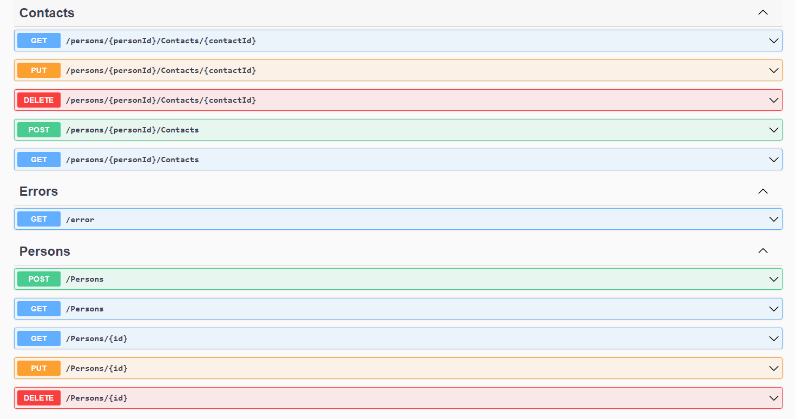

O projeto foi desenvolvido para uma vaga de emprego com o objetivo de criar uma API REST para armazenar pessoas e seus contatos. Com a documentação disponível no link **[Documentação](https://contacteaseapi.azurewebsites.net/swagger/index.html)**.

É importante notar que a API vem com dados padrões para ambiente de desenvolvimento e está hospedada no Azure, com sua URI disponível em **[https://contacteaseapi.azurewebsites.net](https://contacteaseapi.azurewebsites.net/swagger/index.html)**.

A aplicação utiliza salvamento em memoria. No entanto, devido ao serviço de hospedagem gratuito, a aplicação é reiniciada periodicamente, o que pode resultar na perda de dados salvos.
